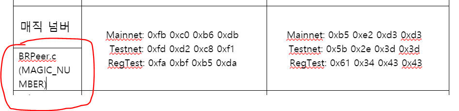

# PC 프로토콜 설정값과 동기화 
- PC(Full node)가 사용하는 프로토콜 설정값[](https://github.com/pyeongtaekcoin-project/pyeongtaekcoin) 안드로이드(SPV node)가 사용하는 프로토콜 설정값[](https://github.com/pyeongtaekcoin-foundation/loafwallet-core/tree/2ea83a2abb82c208900cd098dcb4239cd5a90d7d)은 다르기 때문에 일일히 찾아서 바꿔야 함
- 프로토콜 설정값들중에 바꿔야 할 값들을 태신이 형이 미리 값을 설정하고, 파일을 올렸습니다
- 파일 위치: 팀즈에서 `팀 > 파일 > 수정된 parameter.docx`
 
- 그런데 저 파일은 PC 프로토콜 파일 기준이라서 안드로이드 파일과는 설정값 이름들이 달라서 저희가 [정리한 파일들](https://github.com/QvingCoin/QVingCoin-android-wallet/tree/main/%EB%AC%B8%EC%84%9C/%EB%B6%84%EC%84%9D/%ED%94%84%EB%A1%9C%ED%86%A0%EC%BD%9C-%EC%84%A4%EC%A0%95%EA%B0%92)에서 하나하나 찾아봐야 될거같습니다
 
- 저번주에 알아본 자신꺼 파일에서 비슷한 설정값인것 같으면 태신이 형이 올린 파일에 `파일이름 (설정값 이름)` 으로 셀 분할해서 나중에 고치기 편하게 적어놓으려고 합니다

- ❗자바파일에서도 설정값(네트워크 관련 o, 암호화폐 관련 x)이 세팅되어 있는것 찾아보기 ([링크](https://github.com/pyeongtaekcoin-foundation/loafwallet-android/tree/v1.19.0/app/src/main/java/com))
 
# 주의사항
- PC설정값이 안드로이드에서는 없을 수 도 있음
- 설정값 이름이 다를 수 있음 (설정값으로도 찾아보기, `Ctrl + F`로 검색 가능)
- 자신이 담당한 파일에 없고 다른 사람 파일에 있을 수 도 있음
- 이번주까지 할 예정(~7/3)
- 설정값 왠만큼 다 찾으면 프로젝트 컴퓨터로 다운받아서 실제로 파일에서 설정값 고친다음 다시 깃헙에 올릴 예정 (위쪽의 명령어들(파일 이름 수정 명령어)은 linux 기반 프롬프트인 Git Bash 로 가능할 듯으로 보임)
- 추측해서 적어놓아도 됨 (회의하면서 서로 상의)

 
예시 사진)



# 변경 완료
## Magic Number
```yml
Mainnet: 0xfb 0xc0 0xb6 0xdb 
Testnet: 0xfd 0xd2 0xc8 0xf1 
RegTest: 0xfa 0xbf 0xb5 0xda 
```
to
```yml
Mainnet: 0xb5 0xe2 0xd3 0xd3  
Testnet: 0x5b 0x2e 0x3d 0x3d  
RegTest: 0x61 0x34 0x43 0x43 
```
- 위치: BRPeer.c의 MAGIC_NUMBER


## Genesis n Time
```yml
Mainnet: 1317972665 

Testnet: 1486949366 

RegTest: 1296688602 
```
to
```yml
Mainnet: 1624597387 

Testnet: 1624598584 

RegTest: 1624598704
```
- 위치: BRPeerManager.c의 checkpoint_array 변수


## Genesis n Bits
```yml
Mainnet: 0x1e0ffff0 

Testnet: 0x1e0ffff0 

RegTest: 0x1e0ffff0 
```
to
```yml
Mainnet: 0x1e0ffff0 

Testnet: 0x1e0ffff0 

RegTest: 0x207fffff 
```
- 위치: BRPeerManager.c의 checkpoint_array 변수


## Genesis Hash Block
```yml
Mainnet: 12a765e31ffd4059bada1e25190f6e98c99d9714d334efa41a195a7e7e04bfe2 

Testnet: 4966625a4b2851d9fdee139e56211a0d88575f59ed816ff5e6a63deb4e3e29a0 

RegTest: 530827f38f93b43ed12af0b3ad25a288dc02ed74d6d7857862df51fc56c416f9 
```
to
```yml
Mainnet: f1956f1af956785a5f92e0d3da2d7225e5afc500a0310d669589493d4daabace 

Testnet: 575156c9462296a33dde07661a4eba19e57f646f58bb519d0b81ee51cc52bf50 

RegTest: 482ad56158617cc01c40b3c530cd29d5a4b608ea06c55b93dc212fbedffd31b7 
```
- 위치: BRPeerManager.c의 checkpoint_array 변수


## DNS Seed Node 값
```yml
vSeeds.emplace_back("seed-a.pyeongtaekcoin.loshan.co.uk"); 등 
```
to
```yml
모두 삭제 (1개 정도만 나중에 재활용할 수 있으므로 주석처리) 
```
- 위치: BRPeerManager.c의 dns_seeds변수
- 원래것 주석처리 후 빈 dns_seeds변수 만듦

## Checkpoint Data
```yml
checkpointData = { 

{ 

{  1500, uint256S("0x841a2965955dd288cfa707a755d05a54e45f8bd476835ec9af4402a2b59a2967")}, 

{  4032, uint256S("0x9ce90e427198fc0ef05e5905ce3503725b80e26afd35a987965fd7e3d9cf0846")}, …} 

}; 
```
to
```yml
checkpointData = (CCheckpointData) { { {}, } }; 
```
- 위치: BRPeerManager.c의 checkpoint_array 변수 (이름이 조금 다른것)


## Max Money
```yml
84,000,000 PTC 
```
to
```yml
1,971,000,000 OLC 
```
- 위치: BRTransaction.c의 MAX_MONEY 상수


## n Pow Target Timespan(난이도 재지정 시간)
```yml
consensus.nPowTargetTimespan = 3.5 * 24 * 60 * 60; // 3.5 days 
```
to
```yml
consensus.nPowTargetTimespan = 24 * 60 * 60; // 1 days 
```
- 위치: BRPeerManager.c의 TARGET_TIMESPAN 상수


