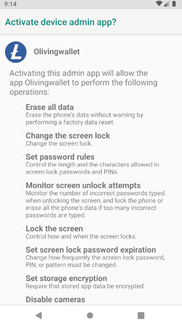
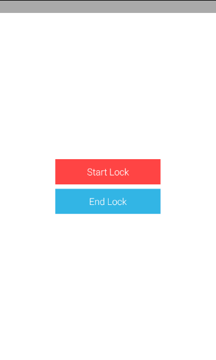

# 설명
- [SimpleKioskDemo_빌드방법](./SimpleKioskDemo_빌드방법.md) 참고해서 작업 해놓아야 함
- 기존 loafwallet-android 앱에 kiosk 기능 적용하는 과정
- [Kiosk 프로젝트](https://github.com/mcsong/SimpleKioskDemo)
- 처음 화면은 Lock, Unlock 버튼의 activity가 나오게 만들고, Lock 버튼을 누르면 kiosk모드 변경과 동시에 loafwallet 앱 지갑 메인 화면 activity로 넘어가게

# 적용 목록
- `com.breadwallet.presenter.activities.intro`에 `kiosk` 패키지 추가
- kiosk 프로젝트의 `BootCompleteReceiver.java`, `KioskDeviceAdminReceiver.java`, `LockUtil.java`, `MainActivity.java` 파일을 
`com.breadwallet.presenter.activities.intro.kiosk` 경로에 복사
- `res/layout`에 `activity_main.xml` 추가 (키오스크 프로젝트의 파일 복사)
- `res/xml`에 `device_admin_receiver.xml` 파일 복사
- `AndroidManifest.xml` 파일도 수정 (시작 activity를 키오스크 모드 버튼 화면으로 설정, 나머지 없는 요소 추가)
```xml
// manifest태그 속성에 xmlns:tools 부분 추가
<manifest xmlns:android="http://schemas.android.com/apk/res/android"
          xmlns:tools="http://schemas.android.com/tools"
          >

  

// 권한 요청목록 추가
<uses-permission android:name="android.permission.RECEIVE_BOOT_COMPLETED" />


// testOnly 요소 추가
<application
    // 생략
    android:testOnly="true"
    >

  
  
// main activity 클래스 변경 (패키지 주의)
<activity
    android:name=".presenter.activities.intro.kiosk.MainActivity"
    android:label="@string/app_name"
    android:launchMode="singleTask"
    android:screenOrientation="portrait">
    <intent-filter android:autoVerify="true">
        <action android:name="android.intent.action.MAIN"/>
        <category android:name="android.intent.category.LAUNCHER"/>
    </intent-filter>
</activity>

  
  
// receiver 추가 (패키지 주의)
<receiver
    android:name=".presenter.activities.intro.kiosk.BootCompleteReceiver"
    android:enabled="true"
    android:exported="false"
    android:directBootAware="true"
    tools:targetApi="n">
    <intent-filter>
        <action android:name="android.intent.action.BOOT_COMPLETED" />
    </intent-filter>
</receiver>

<receiver
    android:name=".presenter.activities.intro.kiosk.KioskDeviceAdminReceiver"
    android:label="@string/app_name"
    android:permission="android.permission.BIND_DEVICE_ADMIN">
    <meta-data
        android:name="android.app.device_admin"
        android:resource="@xml/device_admin_receiver" />

    <intent-filter>
        <action android:name="android.app.action.DEVICE_ADMIN_ENABLED" />
        <action android:name="android.app.action.DEVICE_ADMIN_DISABLE_REQUESTED" />
        <action android:name="android.app.action.DEVICE_ADMIN_DISABLED" />
    </intent-filter>
</receiver>
```


# Lock 버튼 눌렀을 떄 loafwallet의 액티비티로 전환
- Lock 버튼에 리스너 추가
```java

```

# 앱 실행 화면




