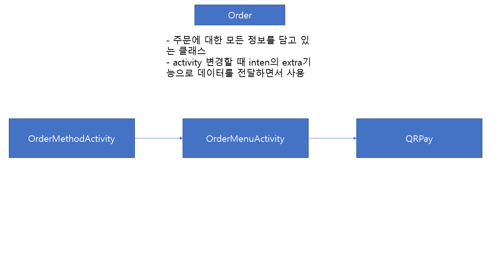
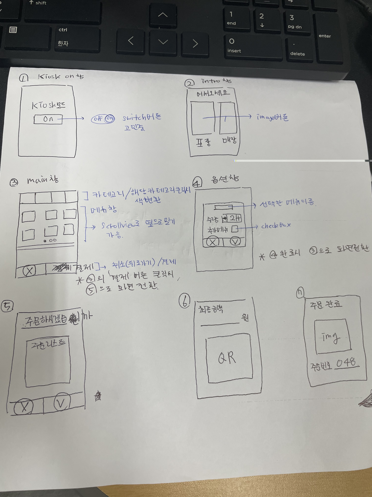

# 그림

# OrderMethod
- 매장, 포장 버튼 (OrderMenu 창으로 이동)
- end lock 버튼

# OrderMenu
- 카테고리 창
- 메뉴 창
- 주문 리스트 창 (내부 아이템 취소 버튼)
- 취소 버튼 (OrderMethod 창으로 이동)
- 결제 버튼 (QRPay 창으로 이동)

# QRPay
- 최종 금액 표시(수정 불가)
- QR 코드 이미지 (금액에 맞게 재생성)
- 결제 끝나면 OrderMethod 창으로 이동

# 전체 흐름
- 

